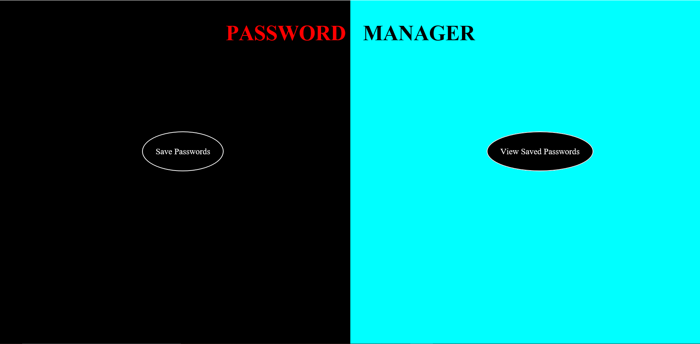
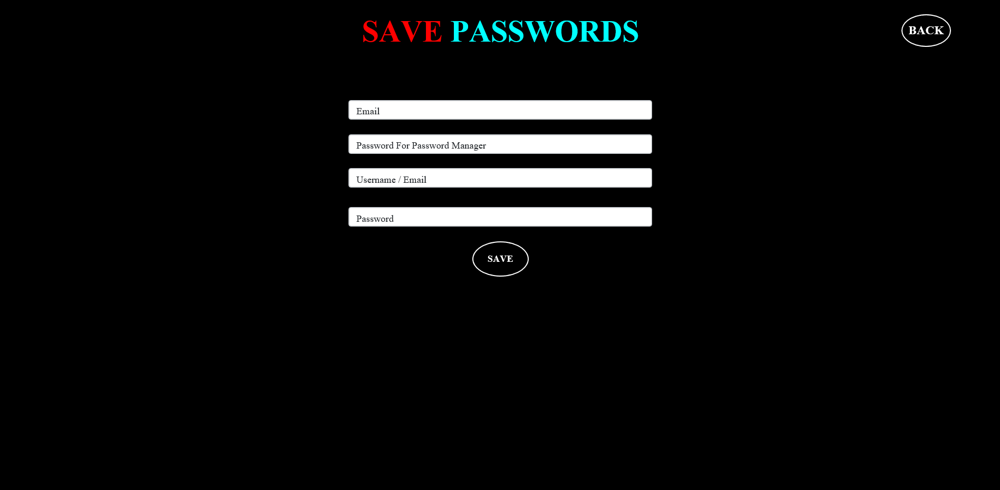
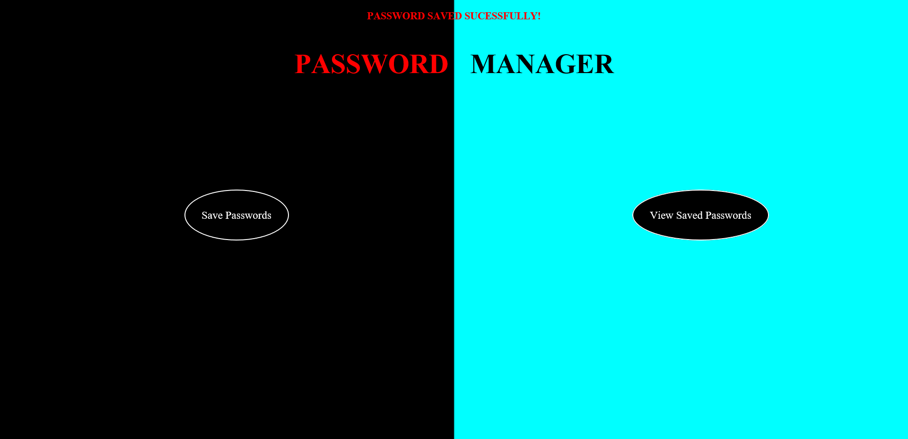
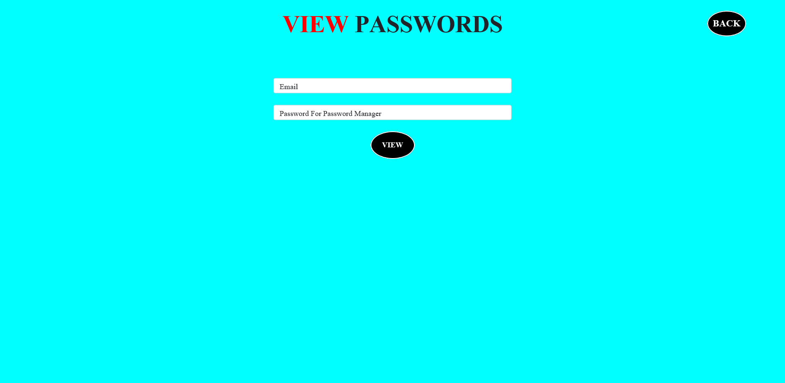
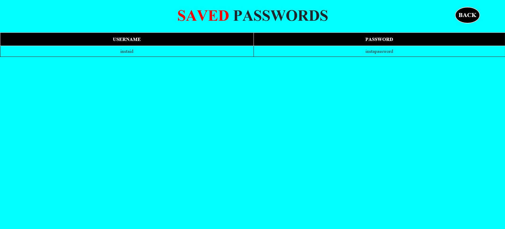
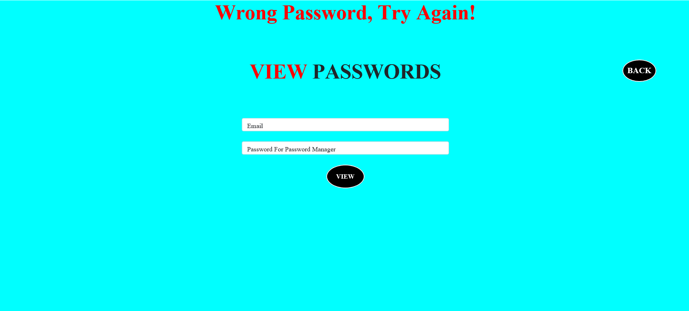
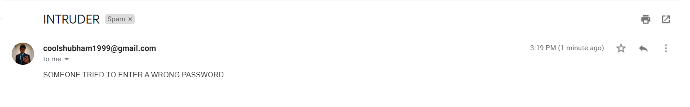

# PASSWORD MANAGER

## Deployment on Netbeans

1. Clone this project.
```bash
  git clone https://github.com/Sam8239/Password_Manager.git 
```
2. Open **Netbeans 8.2**.
3. Go to **File** > Open **Project**.
4. Select the project and click on **Open Project**.
5. Open the **sendmail.jsp** file in Netbeans.
6. Change **from** variable to your **mail address** (Sender's mail). 
7. Change **pass** variable to the **new password**** generated for the app and save the file.
8. Go to **Run** > **Run Project** to compile and run this project.

** Note: To create new password for java mail api Follow the link: https://support.google.com/accounts/answer/185833?hl=en.

## Screenshots

### 1. First Page

 

### 2. Save Password Page

 

### 3. Successfully Save Password



### 4. View Passwords Login Page



### 5. View Saved Passwords



### 6. Entered Wrong Password



### 7. Confirmation of mail received on entering wrong password


